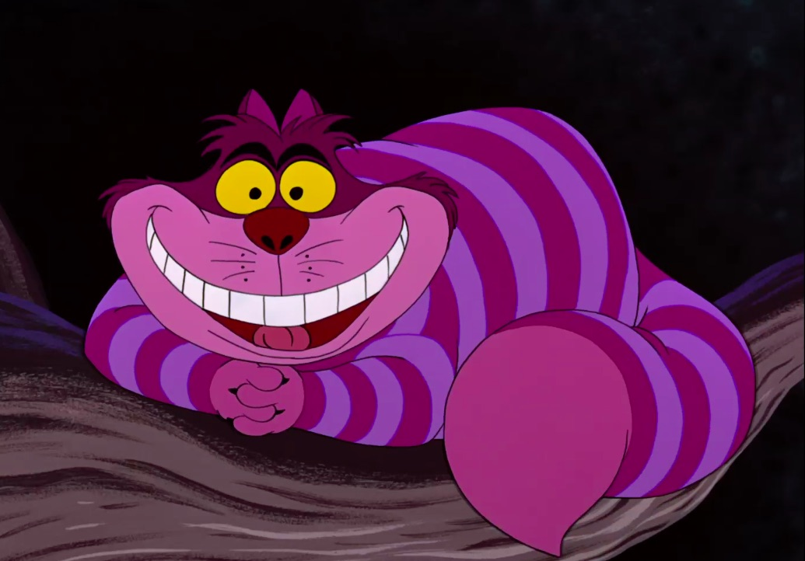
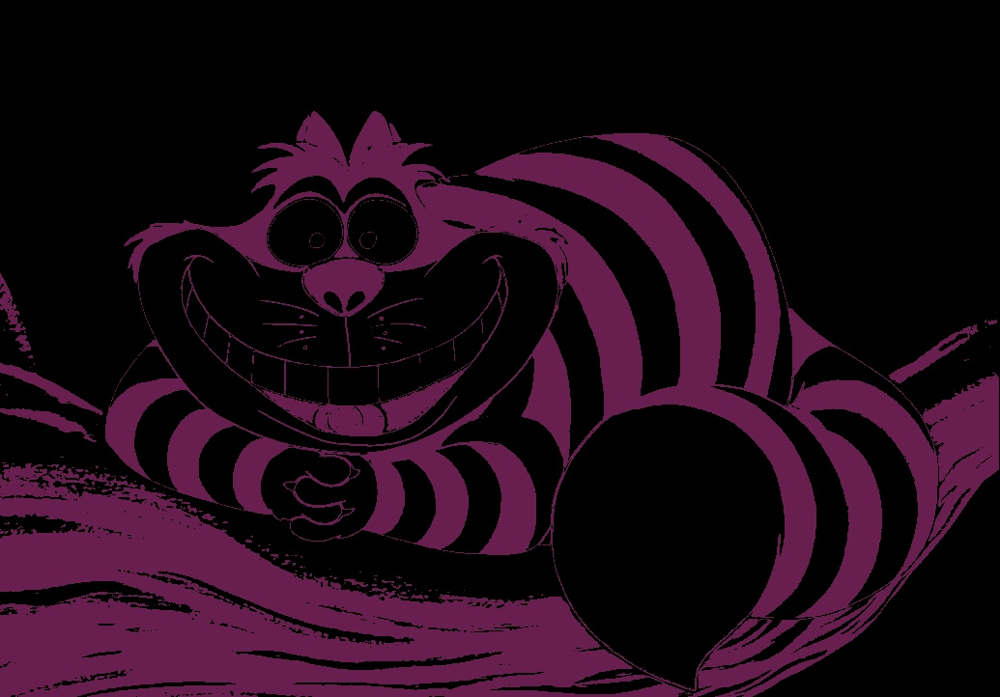
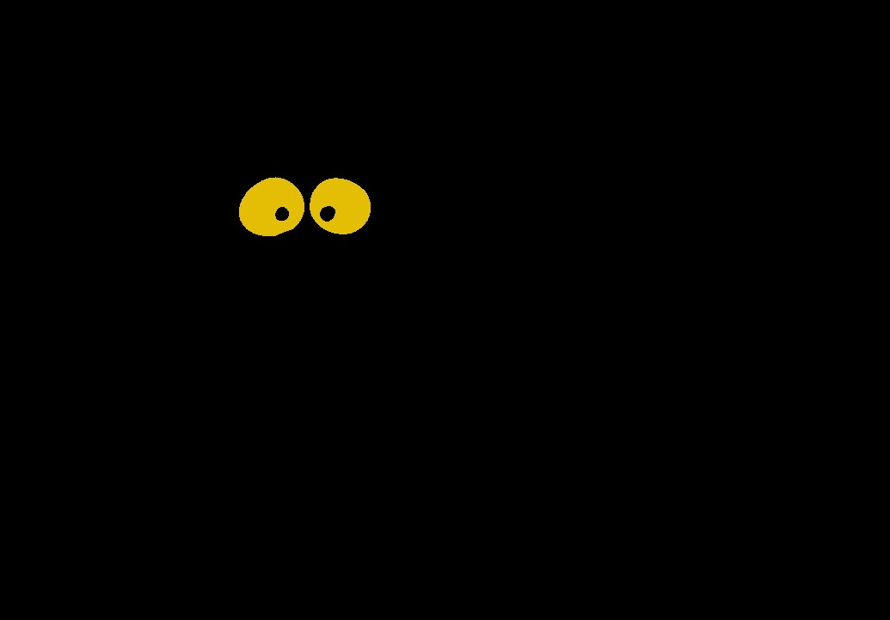

<h1 align="center";
    font-family: Georgia, sans-serif;
    text-decoration: none;
    background: #ffbdfb;
    padding: 3px 6px;
    color: #000;
    font-size: 28px;>
    <a href="#">
    </a>
</h1>

<p align="center">
  <b>Street art by clustering.
</p>

<p align="center">
  <a href="#"></a>
</p>

<p align="right">
Pics by <a href="https://www.instagram.com/alys.cheshire/)">@alys.cheshire</a>
</p>

## Why ?

> But, said Alice, if the world has absolutely no sense, who's stopping us from inventing one ?  
> **_L. Caroll_**

## Quick start

Take a nice picture :  
<p align="center">
  <a href="#"></a>
</p>

Generate a 4 colors stencil model :
```python
>> import cheshire

>> pics = cheshire.Cheshire('/pics_path.jpg', 4)
>> pics.stencil()
```

 Stencil 1                 |  stencil 2                 |   stencil 3               | stencil 4                 |
:-------------------------:|:--------------------------:| :-----------------------: | :-----------------------: |
  |   |  |  |


Final result rendering with all stencils :

<p align="center">
  <a href="#"></a>
</p>

Cut it, paint it.  
Enjoy !

## Install

```
pip install git+https://github.com/tlentali/cheshire.git
```

## How ?
Behind this script, you will find algos used for marketing, financial prediction and client targeting.  
The pics is tranlated into a matrice, each value indicate a pixel color in three dimension.  
Then, clustering algorithm is used to reshape the picture by colors. The number of colors desired is a parameter and is chosen directly by the user.  
As an output you have the picture with the number of color you choose and a picture by color to elaborate each stencils one by one.  
